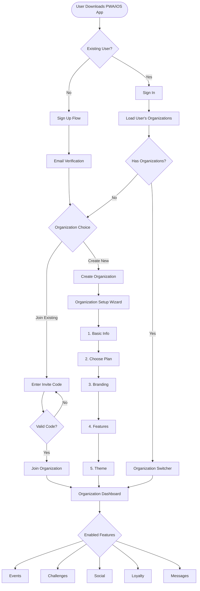
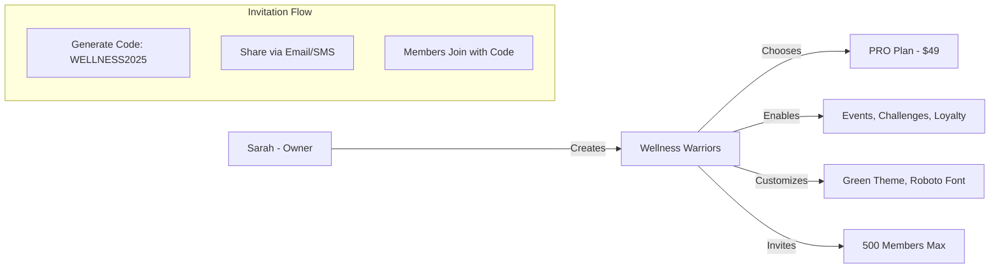
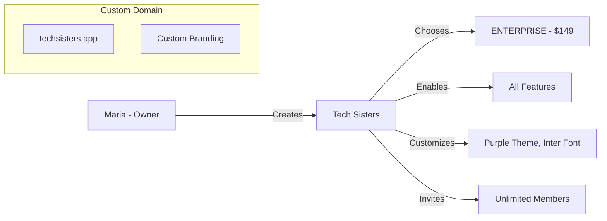
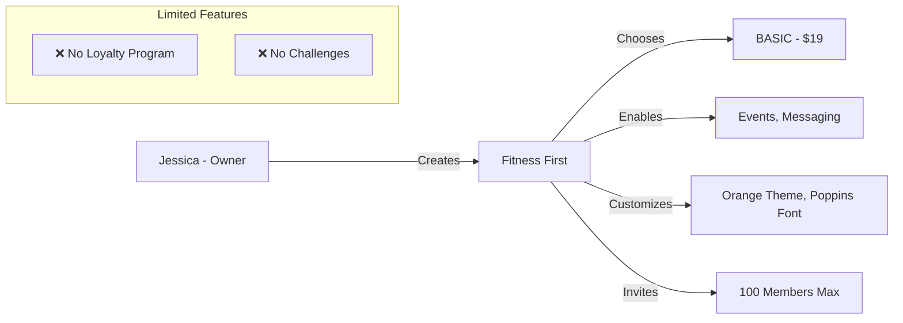
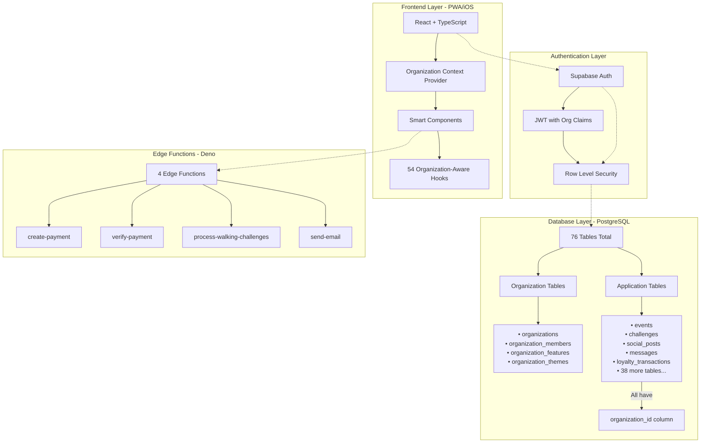
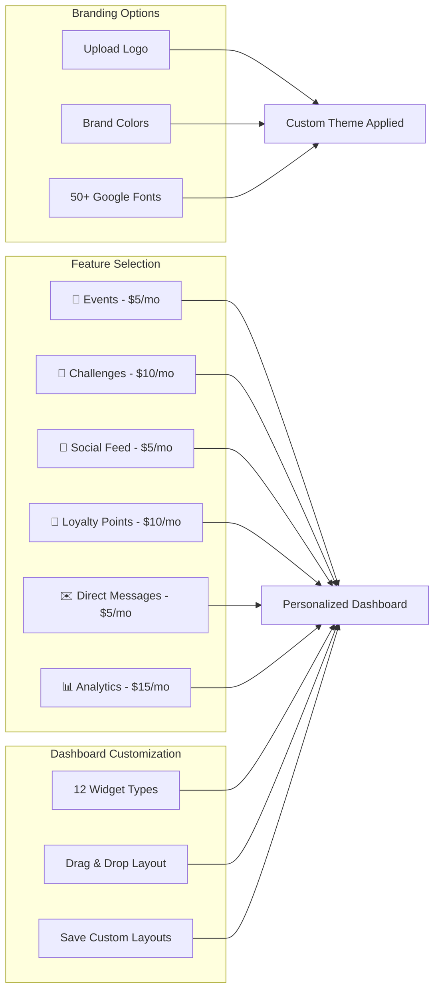
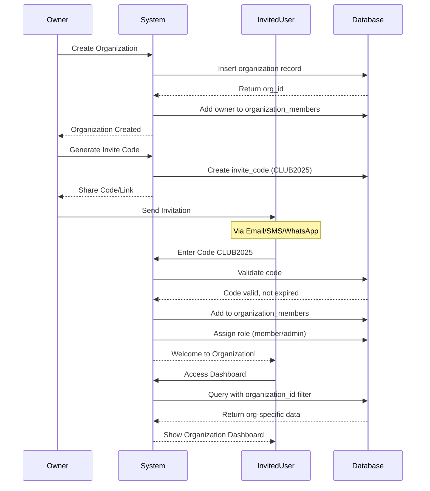
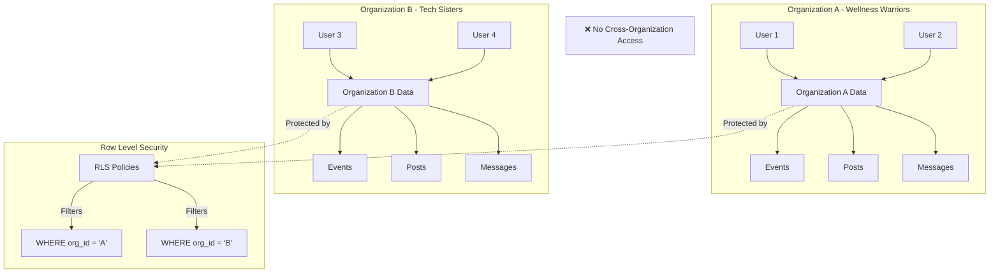
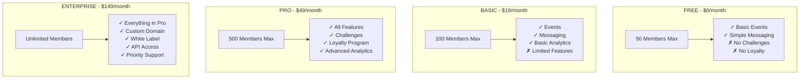
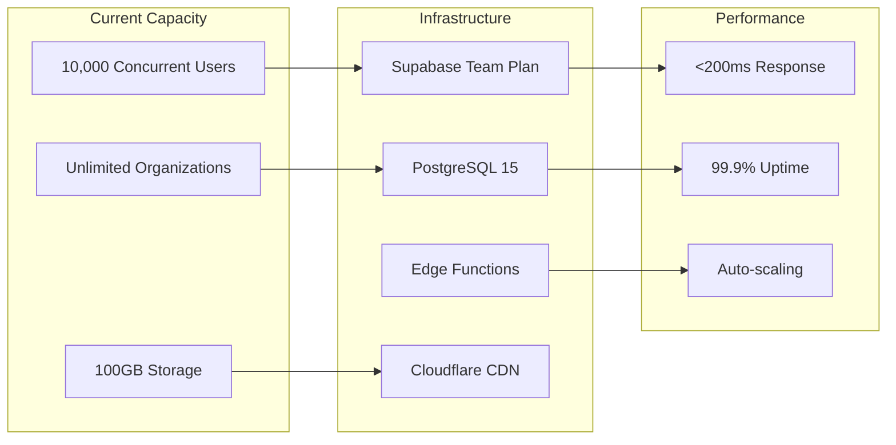

# 🗺️ HUMBL GIRLS CLUB - MULTI-TENANT PLATFORM ARCHITECTURE

## 🎯 Complete User Journey & System Flow

## 🏢 THREE ORGANIZATIONS SCENARIO

### Organization A: "Wellness Warriors"

### Organization B: "Tech Sisters"

### Organization C: "Fitness First"

## 📱 COMPLETE APPLICATION ARCHITECTURE

## 🎨 ORGANIZATION CUSTOMIZATION FLOW

## 👥 MEMBER INVITATION & MANAGEMENT FLOW

## 🔐 DATA ISOLATION ARCHITECTURE

## 📊 SUBSCRIPTION TIERS & FEATURES

## 🚀 PLATFORM SCALABILITY

## 🎯 USER JOURNEY SUMMARY

1. **Download & Sign Up** → User downloads PWA/iOS app, creates account
2. **Organization Decision** → Join existing org with code OR create new org
3. **Setup Wizard** → Configure organization (name, plan, features, theme)
4. **Invite Members** → Generate codes, send invitations, manage roles
5. **Access Dashboard** → Personalized, drag-drop dashboard with enabled features
6. **Use Features** → Events, challenges, social feed, loyalty points, messaging
7. **Grow Community** → Add more members, upgrade plan, enable features

## 💡 KEY PLATFORM BENEFITS

- **Complete Isolation**: Each organization's data is completely separate
- **Custom Branding**: Every org can have unique look and feel
- **Flexible Pricing**: Pay only for features you need
- **Scalable**: Handles 10,000+ concurrent users
- **Mobile-First**: iOS PWA with offline support
- **Enterprise Ready**: White-label, custom domains, API access

---

*This architecture supports unlimited organizations, each with their own members, data, and customization, all running on a single platform instance.*